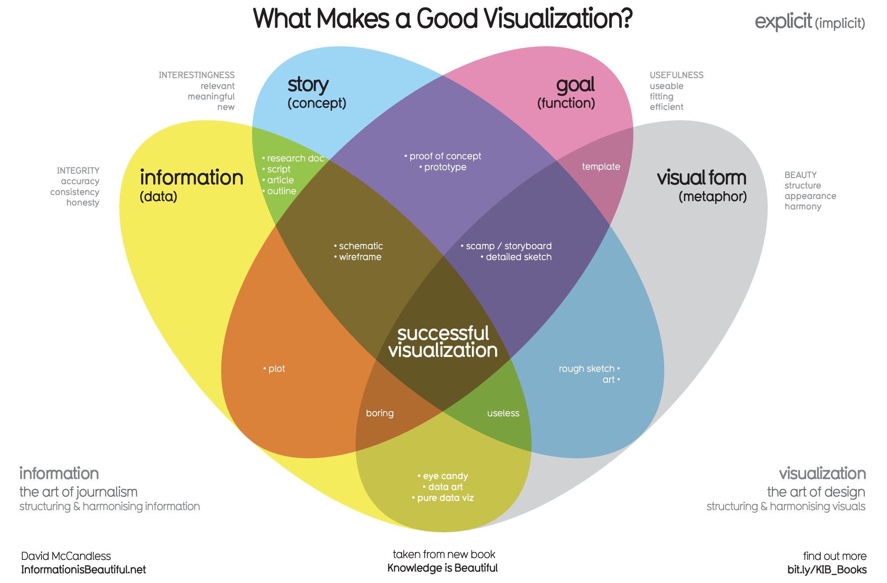

## Key Takeaways (Understanding data visualization)

- **The Role and History of Data Visualization**
	- Data visualization is the graphic representation of data to make information easier to understand.
	- It has a long history, starting with maps and evolving through scientific graphs to modern digital visualizations.
	
	- **Key Elements of Effective Visualizations** [[Effective data visualizations]]
		- Successful visualizations combine four elements: data, story, goal, and visual form.
		- Each element alone has value, but together they create meaningful and engaging visuals that communicate insights clearly.
	
	- **Creating Clear and Convincing Visuals**
		- Visuals should be clear enough for the audience to understand within five seconds and convey the conclusion shortly after.
		- Analysts use visualizations to both interpret data and present findings, helping audiences grasp complex information quickly.
	
	- **The Power and Responsibility of Data Storytelling**
		- Data visualizations can influence opinions and help non-technical audiences understand analysis.
		- Analysts must consider different perspectives and ensure their visual stories are accurate and ethical.

- **Types of Data Visualizations**
	- **Bar graphs** use size contrast to compare values across categories or time, making trends easy to identify.
	- **Line graphs** track changes over time and can compare multiple variables using different colored lines.
	- **Pie charts** show proportions of parts to a whole, helping viewers quickly understand the composition of data.
	- **Maps** organize geographic data visually, making location-based information easy to interpret.
	
	- **Effective Communication and Common Pitfalls**
		- Visualizations should accurately represent data proportions, such as pie chart slices reflecting true percentages.
		- Misleading visuals can occur when scales are manipulated, like truncated bar charts that exaggerate differences.
		- Starting the y-axis at zero in bar charts ensures honest and clear representation of data differences.
	
	- **Best Practices**
		- Use clear, easy-to-understand visualizations that truthfully communicate data insights.
		- Avoid confusing or misleading elements to maintain trust and clarity in data storytelling.

- **One of your biggest considerations when creating a data visualization is where you'd like your audience to focus.**
	
	- **Key considerations in creating visualizations**
		- Focus your audience's attention by showing only the necessary data to avoid confusion or distraction.
		- Balance between showing too much and too little data to maintain clarity and meaning without being misleading.
	
	- **Types of visualizations and their uses**
		- **Time series charts** illustrate changes over time, such as daily or monthly trends.
		- **Histograms** display data distribution by grouping values into ranges or bins.
		- **Ranked bar charts** effectively show ordered data, such as survey responses or ranked items.
		- **Correlation charts** reveal relationships between variables but should be used carefully to avoid implying causation when there is none. [[Correlation and causation]]
	
	- **Choosing the right visualization**
		- Select the visualization type based on your business objective and the story you want to tell.
		- Consider other visualization options and refer to glossaries or resources to find the best fit for your data.

- **Types of Visualizations** [[The wonderful world of visualizations]]
	- **Static visualizations** do not change unless manually edited and are useful for controlled data stories; examples include printed charts and spreadsheet graphs.
	- **Dynamic visualization**s are interactive or update automatically over time, allowing users to explore data by adjusting views or seeing real-time trends.
	
	- **Example and Tools**
		- Tableau is introduced as a tool that creates interactive visualizations, demonstrated with a happiness score dashboard that allows users to explore data by year using a slider.
		- Dynamic visuals can update automatically by various time intervals, supporting real-time trend analysis.
	
	- **Considerations for Visualization Design**
		- Interactive visualizations offer user control but reduce the creator’s control over the narrative.
		- Choosing between static and dynamic depends on the data, audience, and presentation context.
		- Balancing interactivity and control is key to effective data visualization design

---
## Key Takeaways (Design data visualizations)

- **The elements of art:**
	- **Line**
	- **Shape**
	- **Color**
	- **Space**
	- **Movement**
	
	- **Lines** can vary in thickness, direction, and curvature to add structure and form to visualizations.
	
	- **Shapes** should be two-dimensional to avoid confusion, with symmetry aiding recognition and asymmetry still conveying meaning.
	
	- **Colors** have hue (name), intensity (brightness), and value (lightness or darkness). Using shades (darker) and tints (lighter) of colors can highlight data differences and draw attention.
	
	- Proper **spacing** between elements like bars in a bar graph helps focus attention on data rather than empty space.
	
	- **Movement** can show changes over time or correlations but should be used sparingly to avoid distracting the audience.

- **Choosing the Right Visualization** [[Principles of design]], [[Data is beautiful]]
	- The key question in selecting a visualization is which one makes it easiest for the user to understand the intended message.
	
	- Different types of charts serve different purposes, such as line graphs for trends over time, bar charts for comparisons, and scatterplots for relationships.
	
	- **Types of Charts and Their Uses**
		- Line graphs, bar graphs, stacked bars, and area charts are useful for showing data changes over time.
		- Ordered bar and column charts are good for comparing distinct categories, while pie charts, stacked bars, and tree maps show parts of a whole.
		- Scatterplots, bubble charts, and heatmaps help visualize relationships between variables.
	
	- **Elements for effective visuals**
		- **Clear meaning**
		- **Sophisticated use of contrast**
		- **Refined execution with attention to detail**
	
	- Understanding how the human brain processes visual information helps create visuals that are easy to understand and remember.
	
	- The **"five second rule"** emphasizes making visualizations quickly comprehensible to satisfy the audience, typically managers and stakeholders.

- **Design thinking** is a user-centric process to solve complex problems by exploring alternative strategies and challenging assumptions. [[Design thinking for visualization improvement]]
	
	- Airbnb’s example shows how design thinking improved their business by enhancing customer experience through professional photos, leading to increased bookings and revenue.
	
	- **Phases of Design Thinking for Data Visualization**
		- **Empathize**: Understand the emotions and needs of your audience, considering accessibility and appropriateness of colors and presentation style.
		- **Define**: Identify the audience’s needs and problems to determine what data to show and how to present it sensitively.
		- **Ideate**: Brainstorm multiple visualization ideas using insights from earlier phases, always keeping the audience in mind.
		- **Prototype and Test**: Create visualizations and gather feedback from team members or target users to refine and select the best option.

---
## Key Takeaways (Visualization considerations)

- **Highlighting Key Information** [[Pro tips for highlighting key information]]
	- **Headlines**: grab attention and define the data
		- A headline sits above the visualization in large text and briefly describes what data is being shown (e.g., “Average Rents in the Tri-City Area” or “Top 10 coffee producers”).
		- Without a clear headline, viewers may misinterpret what the chart represents; a good headline immediately orients them to the topic being compared.
	
	- **Subtitles**: add essential context
		- A subtitle appears directly under the headline in smaller text and clarifies details like location, time period, or specific groups (e.g., “Oceanside, Vista, and Carlsbad” for the tri-city area).
		- Subtitles help remove ambiguity so the audience quickly understands exactly which data is included.
	
	- **Labels and annotations**: identify and focus the viewer
		- Labels identify axes (e.g., “Months (January–June 2020)” and “Average Monthly Rents ($)”) and can directly label data series instead of relying on a legend, making interpretation faster.
		- Annotations are short notes placed next to specific data points to highlight important values or patterns (like the highest rents), drawing attention without cluttering the chart.
	
	- **Guidelines and style**: keep it simple and readable
		- Use brief, clear language; avoid all caps, italics, acronyms, abbreviations, humor, or rotated text that can slow understanding or distract from the data.
		- Headlines, subtitles, labels, and annotations should work together to be informative but not overly detailed, keeping the visualization simple and elegant so viewers can grasp the message in five seconds or less.

- **Ways to make data visualizations accessible:**
	- **Labeling**
	
	- **Text alternatives![[Pasted image 20260512235939.png]]**
	
	- **Text-based format**
	
	- **Distinguishing**
	
	- **Simplify**
	
	- **Designing for accessibility**
		- Over 1 billion people worldwide have a disability, so visualizations should not assume everyone sees, hears, or processes information the same way; examples include viewers who are deaf/hard of hearing or color blind.
		- An accessibility mindset means planning for diverse audiences from the start: using simple visuals, avoiding clutter, and not relying only on one channel (like color or sound) to convey meaning.
	
	- **Practical techniques to make visuals accessible**
		- Label data directly instead of depending on legends, provide alternative text (alt text) that describes charts, and offer data in text-based formats (like exports to Sheets or Excel) so it can be converted to large print, braille, or speech.
		- Improve visual clarity by using strong foreground–background contrast, using textures/shapes instead of only color to distinguish data, and breaking complex visuals into simpler pieces to keep them understandable at a glance.
	
	- **Why accessibility matters in data visualization**
		- Accessibility is really about making sure that you are creating data visualizations, graphs, charts, tables that anyone can interact with, wether they have a long-term or even a temporary form of impairment.
		
		- As your visualizations are shared beyond you, you won’t always be there to explain confusing colors, small text, or unclear points, so accessible design ensures people can still understand and use the insights.

---

