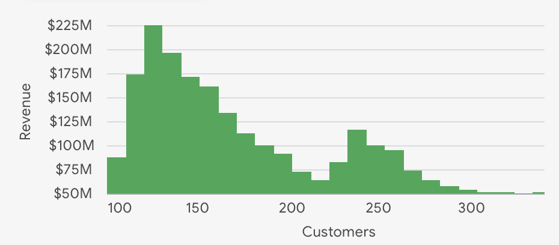
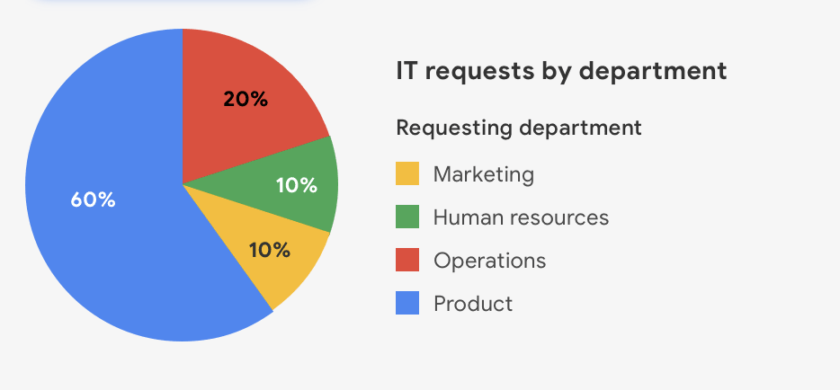
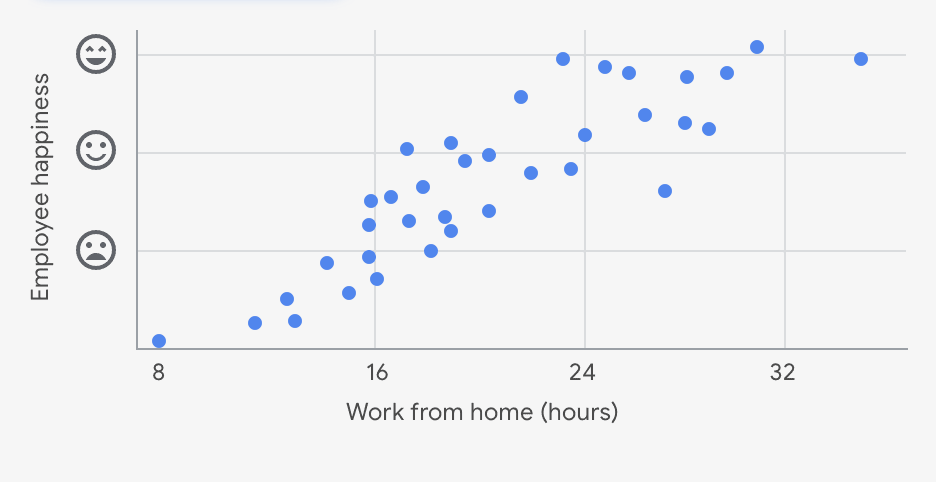

## Key Takeaways (Get started with Tableau)

- **Tableau** is a visual analytics platform designed to simplify data exploration and management. It is widely used across industries for creating impactful visualizations. It supports connecting to various data formats like Excel, CSV, and Google Sheets for flexible data integration.

- **Getting Started with Tableau Public**
	- Download the provided CO2 emissions dataset and log in to Tableau Public.
	- Upload the dataset into Tableau Public by connecting to the data source and loading the relevant sheet.

- **Creating Visualizations**
	- Dimensions (categorical data) and measures (numerical data) are used to build charts; for example, double-clicking "Country" creates a map with countries represented.
	- Adding a measure like "CO2 kilotons" scales the visualization to reflect data values, such as varying dot sizes on the map.

- **Customizing and Managing Visualizations**
	- Customize charts by dragging measures to marks like color, size, or label to enhance communication of data trends.
	- Edit chart titles, clear sheets to start fresh, or delete sheets carefully; use the back button to undo changes.
	- Save and publish your work to share your visualizations with others.

- Each row corresponds to a single data point, and each column represents a different feature.
	
	Tableau automatically interprets the type of data in each column and  displays the following icons above the column names, to indicate how Tableau has interpreted the data in the column:
	
	- **#:** Numeric data
	    
	- **Abc:** String data
	    
	- **Globe:** Geographic data
	    
	- **Calendar:** Date data
	    
	- **Calendar:** Date and time data

- The **Data** pane in the side bar displays column names in a list. In Tableau and most business intelligence software, you will find two types of data elements: **dimensions** and **measures.** According to the [Tableau documentation](https://help.tableau.com/current/pro/desktop/en-us/datafields_typesandroles.htm):
	
	- **Dimensions** contain qualitative values (such as names, dates, or geographical data). You can use dimensions to categorize, segment, and reveal the details in your data. Dimensions affect the level of detail in the view.
	
	- **Measures** contain numeric, quantitative values that you can measure. Measures can be aggregated. When you drag a measure into the view, Tableau applies an aggregation to that measure (by default).
	
	- In the **Data** pane of the Tableau side bar, you’ll see dimensions listed above the gray line and measures below the gray line (under **Measure Names**). These allow you to build and customize charts.

- The main differences between Tableau Public and Tableau Desktop are:
	
	- **Tableau Public**:
	    - Free, web-based version.
	    - Visualizations created are saved publicly and accessible to anyone.
	    - Has some feature limitations compared to Desktop.
	    - Suitable for learning, sharing visualizations online, and non-confidential projects.
	    - Can be used directly in a browser or via a free desktop app.
	
	- **Tableau Desktop**:
	    - Paid version with full features.
	    - Visualizations can be saved privately and securely.
	    - Supports a wider range of data sources and advanced analytics features.
	    - Used for professional work and creating complex dashboards.

---
## Key Takeaways (Design visualizations in Tableau)
[[Essential design principles]]

- **Effective vs. Ineffective Visualizations**
	- A good data visualization should be understood by the audience within five seconds, making it clear, effective, and convincing.
	- Ineffective visualizations often use confusing color schemes, cluttered labels, and inconsistent fonts, which make the data hard to interpret.
	
	- **Use of Color in Visualizations**
		- Diverging color palettes are effective for showing differences between values, using color intensity and hue to indicate magnitude and range.
		- Colors should align with audience expectations, such as green for positive and red for negative, to enhance clarity.
	
	- **Best Practices for Visual Design**
		- Avoid overcrowding visualizations with too many labels or different fonts, as this creates visual noise and reduces readability.
		- Interactive visualizations can be powerful but require careful design to maintain control over the data story being told.

- The key to effective presentations is data visualizations that are clear and convincing. In turn, the key to effective visualizations is selecting the best way to depict your data. 
	
	You have learned about a few types of visualizations (e.g., bar graphs, pie charts) and what each type is best at emphasizing. Determining which type of visualization to use is essential to giving your presentation the impact it needs.
	
	So far, you have considered a few rules about what makes a helpful data visualization:
	
	- **Five-second rule:** A data visualization should be **clear, effective, and convincing** enough to be absorbed in five seconds or less.
	
	- **Color contrast:** Graphs and charts should use a **diverging color palette** to show contrast between elements.
	
	- **Conventions and expectations:** Visuals and their organization should align with **audience expectations** and **cultural conventions**. For example, if the majority of your audience associates green with a positive concept and red with a negative one, your visualization should reflect this.
	
	- **Minimal labels:** Titles, axes, and annotations should use as **few labels** as it takes to make sense. Having too many labels makes your graph or chart too busy. It takes up too much space and prevents the labels from being shown clearly.

- **Creating Visualizations in Tableau**
	
	- Start by creating a new worksheet and filtering data by a specific year (e.g., 2016).
	- Build scatter plots by placing happiness scores on rows and other measures like economy GDP per capita or family on columns, adding country details for individual data points.
	
	- **Analyzing Relationships and Trends**
		- Observe trends such as higher economy scores correlating with higher happiness scores.
		- Add trend lines to visualize relationships clearly and duplicate sheets to compare different measures side by side.
	
	- **Building Dashboards and Enhancing Accessibility**
		- Combine multiple visualizations into a single dashboard for easier comparison.
		- Add companion tables for audiences who prefer tabular data.
		- The course also hints at learning to combine multiple data sources in Tableau for more complex analysis.

- A **line chart** is ideal for highlighting trends over time.
  !(../img/Pasted image 20260518094422.png)

- A **histogram** is ideal for comparing the distribution of two variables by individual grouping.
  

- A **pie chart** is ideal for measuring data as a proportion of the whole.
  

- A **scatter plot** is ideal for exploring potential relationships between two variables.
  

---
## Key Takeaways (Work with multiple data sources)

- **Linking Multiple Datasets in Tableau**
	- You can upload multiple datasets into Tableau Public and link them using JOINs based on common columns like year and country.
	- Different types of JOINs (inner, outer) help combine data from various sources to create a unified dataset.

- **Data Preparation and Cleaning**
	- Change data types appropriately (e.g., year columns to date, numeric columns to number decimal or whole number) to ensure accurate analysis.
	- Adjust datasets to focus on the common time span shared by all datasets for consistent comparison.

- **Creating Visualizations**
	- Use Tableau’s interface to drag fields like country name and CO2 per capita into visualization areas.
	- Customize color palettes and filters to highlight data trends, such as CO2 emissions per capita over selected years.
	- Save and publish your work to share your visualizations and insights effectively.
